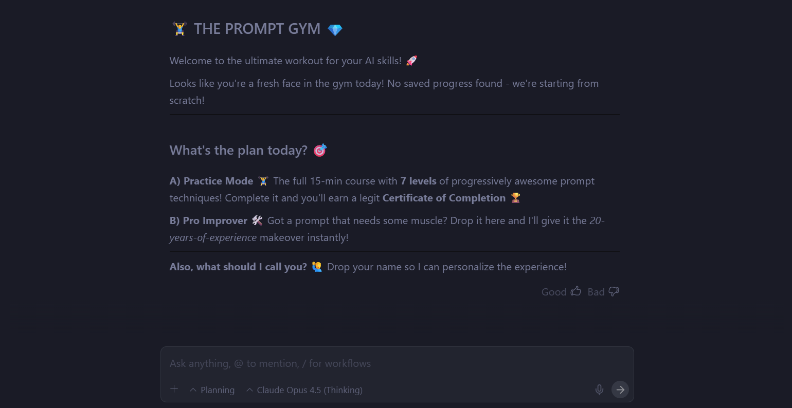

# 🏋️‍♂️ The Prompt Gym 💎

Unlock your AI potential with a 15-minute high-intensity prompt engineering workout.



## 🚀 Instant Install (Antigravity Only)
Copy and paste the text below directly into your Antigravity chat:

> Hey Antigravity, please clone `https://github.com/CodePatrolOPG/Prompt-Engineering.git` into this Workspaces. Once it's ready, run the `/learn-prompting` workflow to start my training session!

---

## 💎 Setup as a Gemini Gem
Want to use the Prompt Gym directly in Google Gemini? [Follow these instructions](./GEMINI_GEM_INSTRUCTIONS.md) to create your own custom Gem:

1. Open [Gemini](https://gemini.google.com/) and click **"Gems"** -> **"New Gem"**.
2. Name it **"The Prompt Gym 🏋️‍♂️"**.
3. Copy and paste the instructions from [GEMINI_GEM_INSTRUCTIONS.md](./GEMINI_GEM_INSTRUCTIONS.md) into the instructions box.
4. Hit **Create**! 🚀

---

## 💻 Manual Setup
1. **Clone this repo:**
   ```bash
   git clone https://github.com/CodePatrolOPG/Prompt-Engineering.git
   ```

2. **Open in Antigravity:**
   Open this folder in your Antigravity IDE.

3. **Start the Workout:**
   Type `/learn-prompting` in the chat to begin your session.

## 🌟 What's Inside?
- **7 Progressive Levels:** From clarity to complex chaining.
- **The Boss Battle:** Test your skills against a real-world nightmare scenario.
- **Pro Improver Mode:** A sandbox to instantly refactor your own prompts.

## 🛠️ Requirements
- Antigravity IDE
